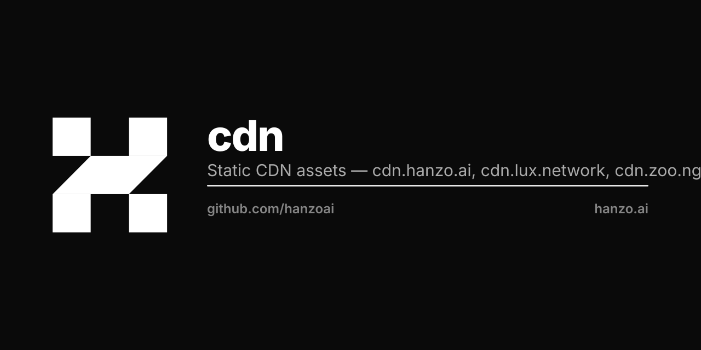

<p align="center"></p>

# Hanzo CDN Assets

Static assets served via Cloudflare Workers + R2 at `cdn.hanzo.ai`.

## Structure

```
hanzo/
├── brand/        Hanzo logo variants (SVG, PNG, favicon, apple, dock icons)
├── buttons/      OAuth provider login button SVGs
├── flag-icons/   271 ISO 3166-1 country flag SVGs
├── fonts/        Inter + Roboto Mono web fonts (woff2)
├── iam/models/   Face recognition models
├── img/          Social provider, payment, captcha, app logos
├── market/       Backend-less Market: agents/tools/plugins catalog (JSON)
├── partners/     Partner/ecosystem logos (AWS, NVIDIA, Techstars, etc.)
├── press/        Press kit assets
└── providers/    AI model provider icons (OpenAI, Anthropic, Mistral, etc.)
```

## Market (no backend required)

The Hanzo / Lux / Zoo desktop apps load their store catalog as **static JSON**
from here, so they work with **no backend**. The app bundles the same files as an
offline fallback (CDN-first, bundle-fallback).

| URL | Contents |
|-----|----------|
| `cdn.hanzo.ai/market/index.json` | manifest (versions, counts, endpoints) |
| `cdn.hanzo.ai/market/agents.json` | agents catalog (paginated `{products,total,…}`) |
| `cdn.hanzo.ai/market/tools.json` | tools catalog |
| `cdn.hanzo.ai/market/categories.json` | categories |
| `cdn.hanzo.ai/market/featured.json` | featured collections |
| `cdn.hanzo.ai/market/plugins.json` | plugin/integration registry (composio) |
| `cdn.hanzo.ai/market/tools/{id}.json` | per-tool detail |

Regenerate from the desktop app's bundled data with `scripts/gen-market.py`.
**CORS:** the Worker must send `Access-Control-Allow-Origin: *` on `/market/*`
so the webviews can fetch directly.

## Deployment

```bash
# (A) existing tool — uploads the whole hanzo/ tree to R2
cd ~/work/hanzo/cdn-worker
./upload.sh ~/work/hanzo/cdn/hanzo hanzo

# (B) self-contained — push just the market data
export CLOUDFLARE_API_TOKEN=... CLOUDFLARE_ACCOUNT_ID=...
R2_BUCKET=pub ./deploy.sh
```

## Domains

- `cdn.hanzo.ai` → `pub/hanzo/*`
- `cdn.lux.network` → `pub/lux/*`
- `cdn.zoo.ngo` → `pub/zoo/*`
- `cdn.pars.network` → `pub/pars/*`
